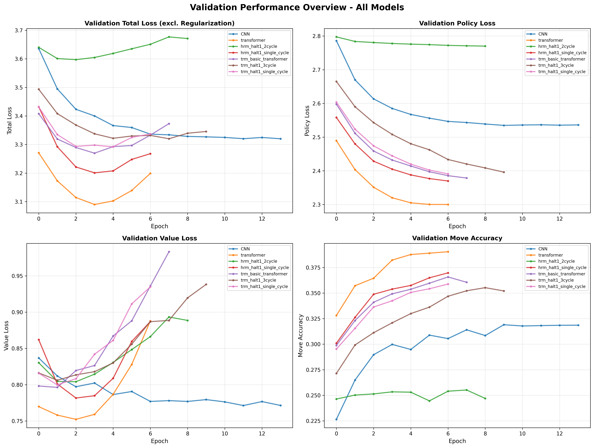
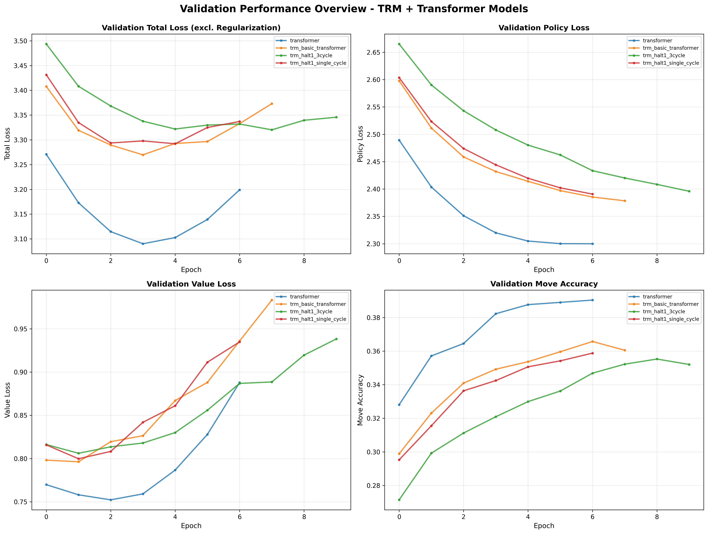

# HRM/TRM Chess

Hierarchical Reasoning Model (HRM) and Tiny Recursive Model (TRM) adapted for chess. Trains models on Leela Chess Zero (LC0) format training data to predict moves, board evaluation, and moves left in the game. Overall, neither the inclusion of the hierarchical reasoning nor the recursive refinement structure yielded improvements over a transformer baseline in the experiments.

## Training Results

> **Note:** See [Model Architectures](#model-architectures) for detailed descriptions of each model configuration and what the naming conventions mean (e.g., halt steps, cycles, hierarchical modules).





More detailed training results are available in the `src/runs/` directory.
```bash
pip install tensorboard
tensorboard --logdir src/runs/
```

## Quick Start

```bash
pip install -r requirements.txt
```
Change version according to the available GPU:
```bash
pip install flash_attn==2.8.3 --no-build-isolation
```

### Dataset
Download LC0 training data:
```bash
cd src/data
wget https://storage.lczero.org/files/training_data/training-run1--20250209-1017.tar
tar -xf training-run1--20250209-1017.tar
```

### Training

```bash
cd src
# Train a single model
python pytorch_train.py --config config/hrm/hrm_halt1_single_cycle.yaml --data-path data/training-run1--20250209-1017

# Train all configs sequentially
python batch_train.py --config-dir config/ --data-path data/training-run1--20250209-1017

# View training logs
tensorboard --logdir runs/
```

## Model Architectures

### Baseline Models

| Model | Hierarchical Modules | Description | Config |
|-------|------------------------|-------------|--------|
| **CNN** | ✗ | 3-layer convolutional baseline | `config/cnn/simple_chess_nn.yaml` |
| **Transformer** | ✗ | Standard transformer with self-attention across 64 squares + RoPE | `config/transformer/transformer_attn_p_head.yaml` |

### HRM Models (Hierarchical Reasoning Model)

Two-level attention architecture with H-level (high-level) and L-level (low-level) reasoning:

| Model Name | Hierarchical Modules | Max ACT Recursive Steps | H-Cycles | L-Cycles | Description | Config |
|------------|--------------------|-----------|----------|----------|-------------|--------|
| **hrm_halt1_single_cycle** | ✓ | 1 | 1 | 1 | Single-step HRM | `config/hrm/hrm_halt1_single_cycle.yaml` |
| **hrm_halt1_2cycle** | ✓ | 1 | 2 | 2 | Single-step HRM with 2 internal refinement cycles | `config/hrm/hrm_halt1_2cycle.yaml` |

### TRM Models (Tiny Recursive Model)

| Model Name | Hierarchical Modules | Max ACT Recursive Steps | H-Cycles | L-Cycles | Description | Config |
|------------|--------------------|-----------|----------|----------|-------------|--------|
| **trm_basic_transformer** | ✗ | 1 | 1 | 1 | Basic TRM, no hierarchical modules | `config/trm/trm_basic_transformer.yaml` |
| **trm_halt1_single_cycle** | ✓ | 1 | 1 | 1 | Single-step TRM without recursion | `config/trm/trm_halt1_single_cycle.yaml` |
| **trm_halt1_3cycle** | ✓ | 1 | 3 | 6 | Single-step TRM with internal refinement cycles | `config/trm/trm_halt1_3cycle.yaml` |
| **trm_halt3** | ✓ | 3 | 1 | 1 | Up to 3 steps of self recursion with Adaptive computation | `config/trm/trm_halt3.yaml` |

**Terminology:**
- **halt_max_steps**: Maximum model self looping steps before halting (1 = fixed computation, >1 = adaptive)
- **Cycles**: Number of internal refinement iterations per step
- **Adaptive Computation Time (ACT)**: Models dynamically decide when to halt based on confidence

### Key Features
- **Adaptive Computation Time (ACT)**: Models can halt after N reasoning steps
- **Hierarchical Reasoning**: Two-level attention (H-level and L-level)
- **Recursive Refinement**: HRM/TRM models refine outputs over multiple internal cycles
- **Attention-based Policy Head**: Maps attention weights to 1858 legal chess moves

## Data Format

Uses **Leela Chess Zero (LC0)** binary format:
- **Input**: 112-channel 8x8 board (piece positions + history + auxiliary info)
- **Outputs**: Policy (1858 moves), Value (WDL), Moves left

## Project Structure

```
src/
├── pytorch_train.py      # Main training script
├── batch_train.py        # Sequential multi-config training
├── chess_dataset.py      # LC0 data parser
├── chess_loss.py         # Loss functions
├── config/               # YAML configs (cnn/, hrm/, trm/, transformer/)
├── model/
│   ├── hrm/hrm_model.py  # HRM implementation
│   ├── trm/trm_model.py  # TRM implementation
│   ├── heads/            # Policy and value heads
│   └── common/           # Shared layers (RoPE, attention, etc.)
└── data/                 # Training datasets
```

## Configuration

Key parameters in YAML configs:
- `halt_max_steps`: Max reasoning steps (1 = single-step, >1 = adaptive)
- `H_cycles`, `L_cycles`: Number of hierarchical reasoning cycles
- `hidden_size`, `num_heads`: Model dimensions

## Acknowledgements
A massive thank you to [Leela Chess Zero](https://lczero.org/) for providing open access to their training data and resources. This project would not have been possible without their contributions, both in terms of data and training scripts availability. The data loading is a PyTorch adaptation of their original TensorFlow code, at https://github.com/LeelaChessZero/lczero-training.